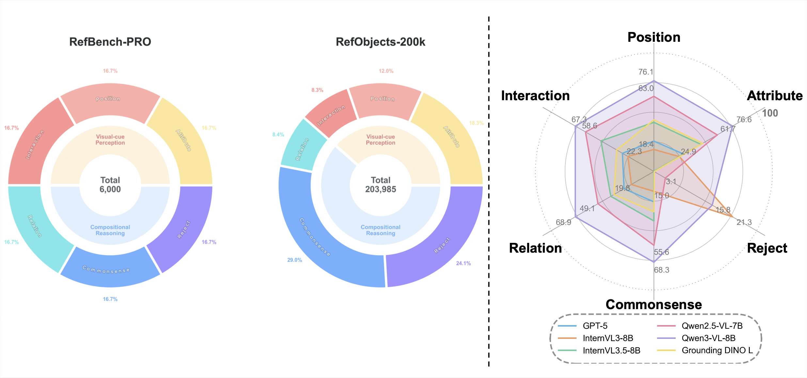
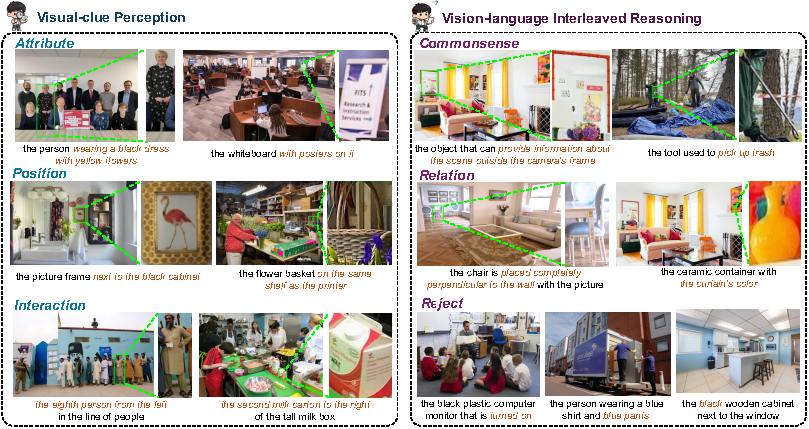

<h1><i>RefBench-PRO: Perceptual and Reasoning Oriented Benchmark for Referring Expression Comprehension</i></h1>

<div align="center">
  <a href="https://arxiv.org/pdf/2512.06276" target="_blank">
    
  </a>
  <a href="https://huggingface.co/datasets/thisis1go/RefBench-PRO" target="_blank">
    
  </a>
  <a href="https://jerrypw.github.io/RefBench-PRO.project_page/" target="_blank">
    
  </a>
</div>



Overview of our RefBench-PRO benchmark and the underlying RefObjects-200k dataset. Starting from 12 million high-resolution images in FineHARD, we construct RefObjects-200k, a challenging referring expression comprehension dataset with **203,985** high-quality instances spanning two core dimensions—**perception and reasoning**—which are further decomposed into six sub-dimensions. RefBench-PRO then selects **6,000** carefully curated samples from RefObjects-200k, 1,000 per category, to rigorously evaluate the referring expression comprehension capabilities of modern MLLMs.

## 📖RefBench-PRO



To comprehensively evaluate the capabilities of MLLMs on referring expression comprehension, our benchmark focuses on two core dimensions:
**visual-cue perception** and **compositional reasoning**. Each dimension is further decomposed into three fine-grained sub-dimensions, resulting in a total of six evaluation categories.

### Visual-Cue Perception
- **Attribute**: evaluates the model’s ability to recognize intrinsic visual properties of objects.
- **Position**: focuses on identifying spatial relationships among different objects.
- **Interaction**: refers to understanding relative relationships among objects of the same category, requiring accurate perception of explicit visual cues aligned with textual descriptions.

### Compositional Reasoning
- **Relation**: involves compositional referring expressions that require reasoning over multiple objects simultaneously.
- **Commonsense**: assesses the model’s ability to identify objects through contextual or implicit descriptions rather than explicit naming.
- **Rejection**: tests whether the model can correctly handle referring expressions that describe objects absent from the image.

## 📦Data Access and Evaluation
Researchers may refer to the provided [Hugging Face link](https://huggingface.co/datasets/thisis1go/RefBench-PRO) to access a **partial release of the RefBench-PRO benchmark**.  
We have publicly released **all images and referring expressions** in RefBench-PRO, along with **bounding box annotations for 1,200 samples**, evenly distributed across the six sub-dimensions (200 samples per category), to support evaluation and comparison.

We warmly invite the community to evaluate their models on RefBench-PRO and encourage researchers to share their evaluation results with us via email (tyigao@stu.xjtu.edu.cn).  
Upon receiving the evaluation results, we will provide access to the full version of the RefBench-PRO dataset, and the submitted results will be included in the public leaderboard on our [project website](https://jerrypw.github.io/RefBench-PRO.project_page/) to promote transparent and reproducible benchmarking.

### Data Format
```json
{
  "image_path": "The basename of image.",
  "task_type":"The category of the referring task ('attribute', 'positioin', 'interaction', 'relation', 'commonsense', 'reject').",
  "expression": "Referring expression.",
  "bbox":"The ground truth bounding box corresponding to the expression. For 'reject' tasks, this is an empty list [].",
  "width":"The original image width.",
  "height":"The original image height.",
}
```


### Benchmarking

To perform benchmark evaluation, you first need to run the model inference on the benchmark dataset and save its prediction results, **including phrase_type, bounding box** .
- `prediction_file` should be in `.jsonl` format, with each line formatted as follows: 
```json
{
  "image_path": "[Optional] The basename of image.",
  "task_type":"The category of the referring task ('attribute', 'positioin', 'interaction', 'relation', 'commonsense', 'reject').",
  "expression": "[Optional] Referring expression.",
  "bbox":"The ground truth bounding box corresponding to the expression. For 'reject' tasks, this is an empty list [].",
  "pred_bbox": "The predicted bounding box from the model, resized to match the original image's resolution.",
  "response":"[Optional] The full, raw text response generated by the model.",
}
```
**Then, calculate the metrics with :**
```sh
python get_prediction_Acc.py  --prediction_file your_prediction_file.jsonl
``` 

This example runs model inference and calculates benchmark accuracy in a single script.
```sh
python eval_qwen3vl.py
```

For other models, you should modify the following parts:
- Model Loading and Inference: The code that loads your model and generates a response.
- extract_bbox_from_response(): To parse the bounding box from your model's raw output.
- resize_bbox(): To scale the bounding box coordinates to match the original image's resolution.

## Acknowledgement

We thank the creators of the [FineHARD](https://huggingface.co/datasets/qihoo360/FineHARD) dataset for providing a large-scale collection of high-quality images, which serves as the foundation for constructing the RefObjects-200k dataset and the RefBench-PRO benchmark. We also gratefully acknowledge the [Qwen-VL](https://github.com/QwenLM/Qwen3-VL) team for their powerful multimodal models and open-source efforts, which significantly supported the data construction and validation processes in our benchmark.


## 📝Citation

```
@article{gao2025refbench,
  title={RefBench-PRO: Perceptual and Reasoning Oriented Benchmark for Referring Expression Comprehension},
  author={Gao, Tianyi and Li, Hao and Fang, Han and Wei, Xin and Dong, Xiaodong and Sun, Hongbo and Yuan, Ye and He, Zhongjiang and Xu, Jinglin and Xin, Jingmin and others},
  journal={arXiv preprint arXiv:2512.06276},
  year={2025}
}
```